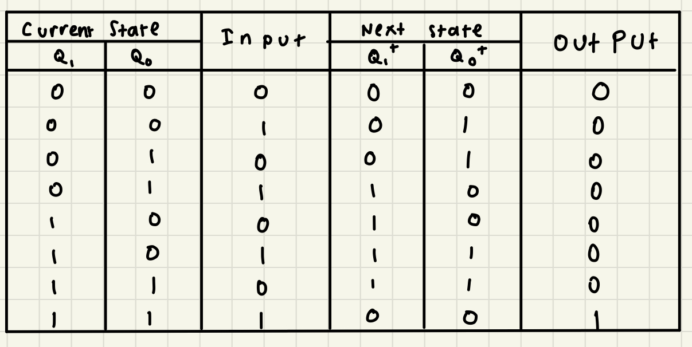

# FSM-Final-Project
A C program of a gumball vending machine that is simulated using the concept of Finite State Machine.

## About the vending machine
A vending machine that accepts cents in which it will dispense a gumball once 0.4 cents is desposited.

There is 4 states:
- 0.0 cent (00)
- 0.1 cent (01)
- 0.2 cents (10)
- 0.3 cents (11)

There is 2 inputs:
- 0 (no coin inserted)
- 1 (0.1 cent inserted)

## State Diagram


## State and Transition Table


## K-Map


## Visualization
### How to run
In you terminal you should type
```
make all
```

